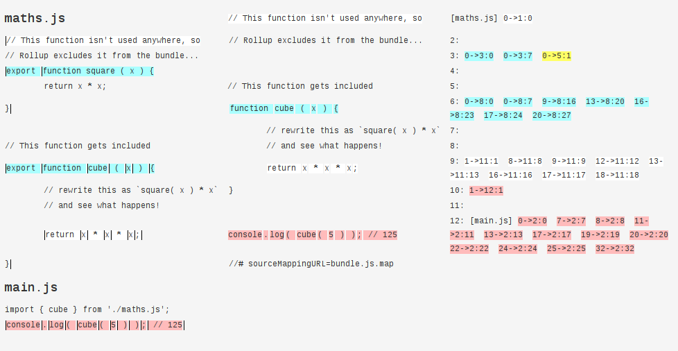
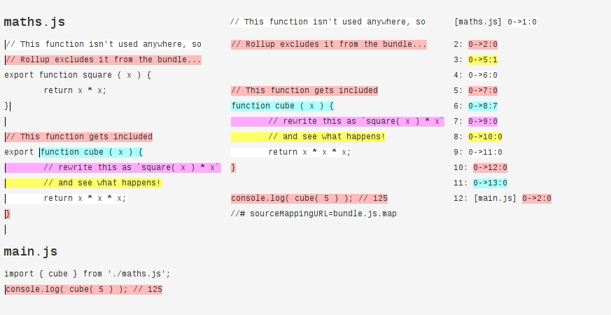

# source-map-compactor

Compacts sourcemaps, merging spurious mappings.

### Rationale

I love [Rollup](http://rollupjs.org). I really do.

But.

Sometimes the sourcemaps look crazy, and make my browser choke on them, confuse variable scopes, prevent setting breakpoints, and generally misbehave.

This is due to the way [`magic-string`](https://github.com/rich-harris/magic-string) handles sourcemap mappings.

To remedy that, `source-map-compactor` looks at a sourcemap and performs four naïve optimizations:

* Inserts blank line mappings when there is no mapping for a generated line.
* Inserts blank character mappings at column 0 if there is no mapping for column 0 in a generated line.
* Removes duplicated mappings to the same generated line-column (happens when `magic-string` replaces something with an empty string)
* Removes duplicated mappings for contiguous segments of the same length (happens when `magic-string` copies several tokens in succesion)

These optimizations are not exhaustive, but they should create simpler and more reliable sourcemaps in most workflows.

### Demo

The optimizations are easier to see with something like [`source-map-visualization`](https://github.com/sokra/source-map-visualization):

#### Before:


#### After:



### Usage

Install it from NPM:
```
yarn add source-map-compactor
```

In JS, require it and call it. It expects a string representing the sourcemap JSON, and returns a string representing a sourcemap JSON.

```js
var compactor = require('source-map-compactor');
var fs = require('fs');

var sourceMapText = fs.readFileSync('bundle.js.map').toString();
var compactedSourceMapText = compactor(sourceMapText);
fs.writeFileSync('bundle.js.map', compactedSourceMap);
```

In a shell, run `source-map-compactor` with the filenames for input and output files, e.g.:

```
./node_modules/source-map-compactor build/bundle.js.map build/bundle.js.compacted.map
```


### License

"THE BEER-WARE LICENSE":
<ivan@sanchezortega.es> wrote this file. As long as you retain this notice you
can do whatever you want with this stuff. If we meet some day, and you think
this stuff is worth it, you can buy me a beer in return.
